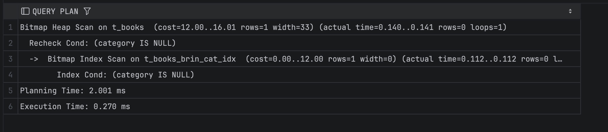
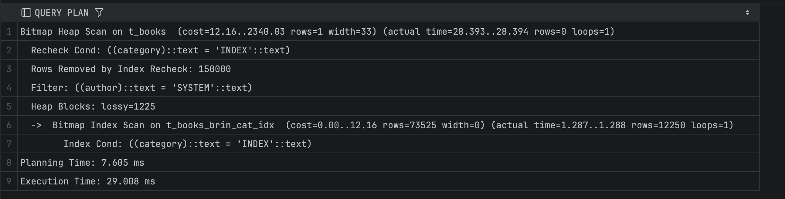
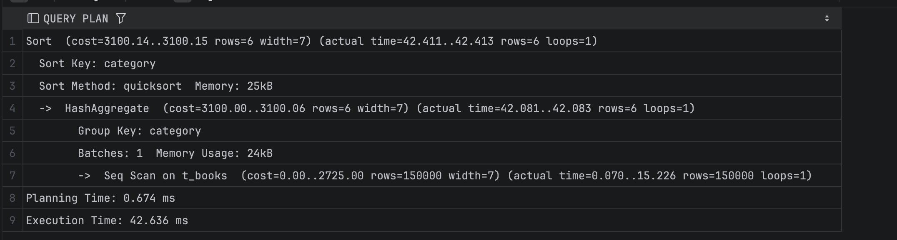
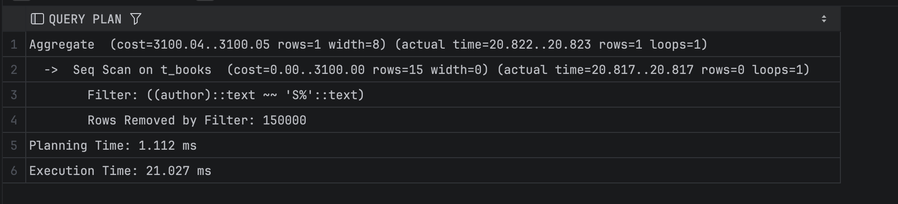
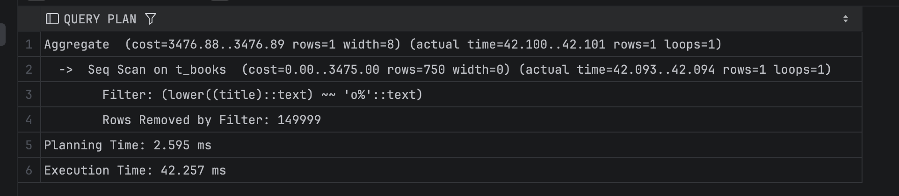
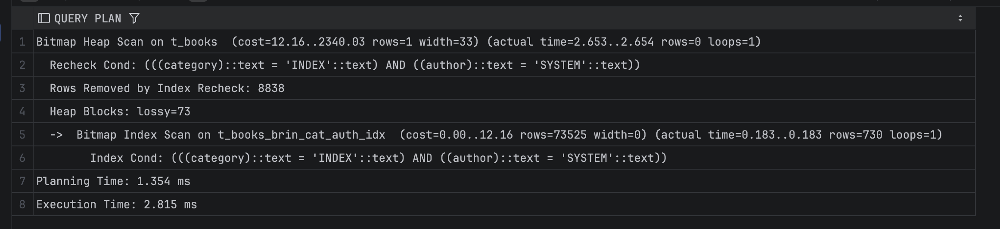

# Задание 1: BRIN индексы и bitmap-сканирование

1. Удалите старую базу данных, если есть:
   ```shell
   docker compose down
   ```

2. Поднимите базу данных из src/docker-compose.yml:
   ```shell
   docker compose down && docker compose up -d
   ```

3. Обновите статистику:
   ```sql
   ANALYZE t_books;
   ```

4. Создайте BRIN индекс по колонке category:
   ```sql
   CREATE INDEX t_books_brin_cat_idx ON t_books USING brin(category);
   ```

5. Найдите книги с NULL значением category:
   ```sql
   EXPLAIN ANALYZE
   SELECT * FROM t_books WHERE category IS NULL;
   ```
   
   *План выполнения:*
 
   
   *Объясните результат:*  
   При выполнении запроса PostgreSQL использовал BRIN-индекс и bitmap scan. BRIN определяет только диапазоны страниц, на которых значения category могут быть NULL, поэтому потребовался Bitmap Heap Scan с повторной проверкой строк (Recheck Cond). Bitmap-подход позволяет эффективно обработать страницы, вместо полного последовательного сканирования таблицы. В результате запрос был выполнен быстрее, несмотря на отсутствие фактических строк с NULL.

6. Создайте BRIN индекс по автору:
   ```sql
   CREATE INDEX t_books_brin_author_idx ON t_books USING brin(author);
   ```

7. Выполните поиск по категории и автору:
   ```sql
   EXPLAIN ANALYZE
   SELECT * FROM t_books 
   WHERE category = 'INDEX' AND author = 'SYSTEM';
   ```
   
   *План выполнения:*
 
   
   *Объясните результат (обратите внимание на bitmap scan):*   
   Запрос выполняется через bitmap index scan по BRIN-индексу category. BRIN определяет страницы, где может находиться значение category=‘INDEX’, поэтому PostgreSQL выполняет Bitmap Heap Scan с обязательной перепроверкой строк (Recheck). Условие по author не использует индекс, поэтому фильтрация выполняется после извлечения данных. Большая часть строк отбрасывается (Rows Removed by Index Recheck), что повышает стоимость операции. Bitmap-модель выбрана, поскольку позволяет эффективно обрабатывать диапазоны страниц, а не выполнять последовательный просмотр таблицы.

8. Получите список уникальных категорий:
   ```sql
   EXPLAIN ANALYZE
   SELECT DISTINCT category 
   FROM t_books 
   ORDER BY category;
   ```
   
   *План выполнения:*
 
   
   *Объясните результат:*  
   Запрос выполняется через последовательное сканирование таблицы. PostgreSQL счёл использование BRIN-индекса неэффективным, поскольку BRIN хранит только диапазоны страниц и не подходит для извлечения списка уникальных значений. После seq scan выполняется HashAggregate, который формирует множество уникальных категорий. Затем выполняется сортировка результатов по category, как указано в ORDER BY. Итоговый набор небольшой, поэтому сортировка выполняется быстро.

9. Подсчитайте книги, где автор начинается на 'S':
   ```sql
   EXPLAIN ANALYZE
   SELECT COUNT(*) 
   FROM t_books 
   WHERE author LIKE 'S%';
   ```
   
   *План выполнения:*
 
   
   *Объясните результат:*  
   Запрос выполняется через последовательное сканирование таблицы t_books. Несмотря на наличие BRIN-индекса по author, он не используется, так как условие author LIKE 'S%' представляет собой поиск по шаблону, для которого BRIN не даёт достаточного выигрыша: индекс хранит только диапазоны значений по страницам. Поэтому оптимизатор выбирает seq scan и применяет фильтр author LIKE 'S%' к каждой строке. Узел Aggregate затем подсчитывает количество подходящих строк (в нашем случае их нет, что видно по Rows Removed by Filter: 150000).

10. Создайте индекс для регистронезависимого поиска:
    ```sql
    CREATE INDEX t_books_lower_title_idx ON t_books(LOWER(title));
    ```

11. Подсчитайте книги, начинающиеся на 'O':
    ```sql
    EXPLAIN ANALYZE
    SELECT COUNT(*) 
    FROM t_books 
    WHERE LOWER(title) LIKE 'o%';
    ```
   
   *План выполнения:*
 
   
   *Объясните результат:*  
   Запрос выполняется через последовательное сканирование таблицы с фильтром LOWER(title) LIKE 'o%'. Несмотря на наличие функционального B-tree индекса по LOWER(title), оптимизатор решил его не использовать: по его оценке под условие попадает достаточно много строк, и чтение всей таблицы с последующей фильтрацией дешевле, чем индексное сканирование с множеством обращений к heap. В результате PostgreSQL просматривает все 150 000 строк, вычисляет LOWER(title) для каждой и отбрасывает большинство из них (Rows Removed by Filter: 149999), а узел Aggregate подсчитывает количество найденных книг.

12. Удалите созданные индексы:
    ```sql
    DROP INDEX t_books_brin_cat_idx;
    DROP INDEX t_books_brin_author_idx;
    DROP INDEX t_books_lower_title_idx;
    ```

13. Создайте составной BRIN индекс:
    ```sql
    CREATE INDEX t_books_brin_cat_auth_idx ON t_books 
    USING brin(category, author);
    ```

14. Повторите запрос из шага 7:
    ```sql
    EXPLAIN ANALYZE
    SELECT * FROM t_books 
    WHERE category = 'INDEX' AND author = 'SYSTEM';
    ```
   
   *План выполнения:*
 
   
   *Объясните результат:*  
   После создания составного BRIN-индекса по category и author PostgreSQL использовал Bitmap Index Scan по новому индексу. Такой индекс хранит диапазоны страниц сразу по двум колонкам, поэтому диапазоны, где потенциально могут находиться строки с category=‘INDEX’ и author=‘SYSTEM’, определяются точнее. Это приводит к уменьшению числа lossy страниц и снижению количества строк, которые требуется перепроверять в heap. Благодаря этому Bitmap Heap Scan выполняется существенно быстрее и общее время запроса сокращается примерно в 10 раз по сравнению с предыдущим вариантом.