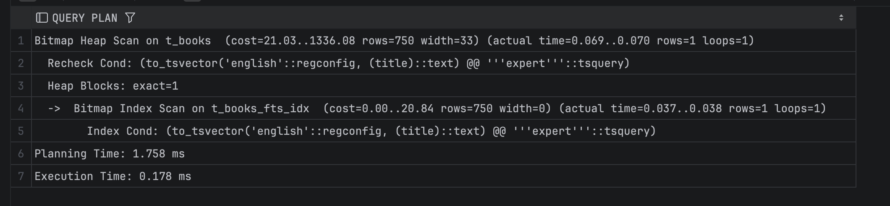
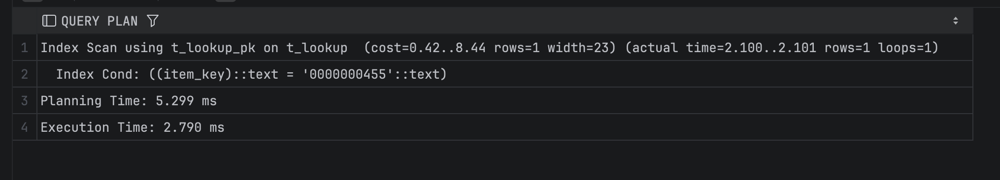
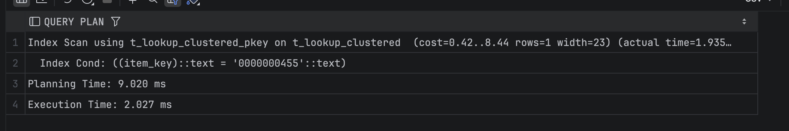
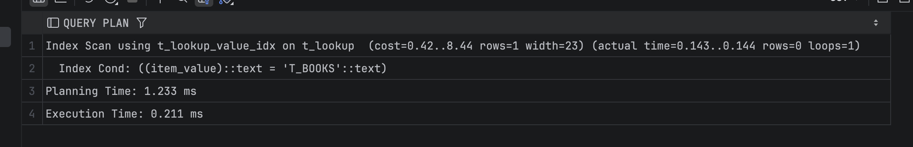
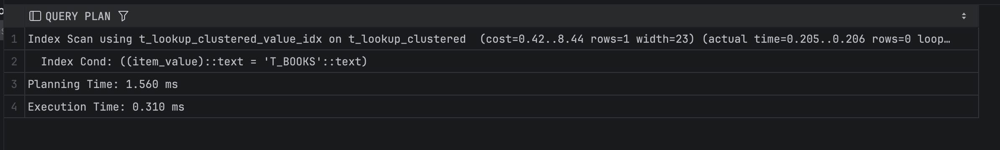

## Задание 2

1. Удалите старую базу данных, если есть:
    ```shell
    docker compose down
    ```

2. Поднимите базу данных из src/docker-compose.yml:
    ```shell
    docker compose down && docker compose up -d
    ```

3. Обновите статистику:
    ```sql
    ANALYZE t_books;
    ```

4. Создайте полнотекстовый индекс:
    ```sql
    CREATE INDEX t_books_fts_idx ON t_books 
    USING GIN (to_tsvector('english', title));
    ```

5. Найдите книги, содержащие слово 'expert':
    ```sql
    EXPLAIN ANALYZE
    SELECT * FROM t_books 
    WHERE to_tsvector('english', title) @@ to_tsquery('english', 'expert');
    ```
    
    *План выполнения:*
 
    
    *Объясните результат:*  
    Запрос выполняется через полнотекстовый GIN-индекс t_books_fts_idx. PostgreSQL использует Bitmap Index Scan, поскольку GIN формирует bitmap для найденных токенов. Далее Bitmap Heap Scan извлекает соответствующие строки и выполняет recheck условия. Благодаря тому, что поиск осуществляется по заранее рассчитанным лексемам и индекс точно определяет страницы heap (exact=1), запрос выполняется очень быстро и не требует последовательного чтения всей таблицы.

6. Удалите индекс:
    ```sql
    DROP INDEX t_books_fts_idx;
    ```

7. Создайте таблицу lookup:
    ```sql
    CREATE TABLE t_lookup (
         item_key VARCHAR(10) NOT NULL,
         item_value VARCHAR(100)
    );
    ```

8. Добавьте первичный ключ:
    ```sql
    ALTER TABLE t_lookup 
    ADD CONSTRAINT t_lookup_pk PRIMARY KEY (item_key);
    ```

9. Заполните данными:
    ```sql
    INSERT INTO t_lookup 
    SELECT 
         LPAD(CAST(generate_series(1, 150000) AS TEXT), 10, '0'),
         'Value_' || generate_series(1, 150000);
    ```

10. Создайте кластеризованную таблицу:
     ```sql
     CREATE TABLE t_lookup_clustered (
          item_key VARCHAR(10) PRIMARY KEY,
          item_value VARCHAR(100)
     );
     ```

11. Заполните её теми же данными:
     ```sql
     INSERT INTO t_lookup_clustered 
     SELECT * FROM t_lookup;
     
     CLUSTER t_lookup_clustered USING t_lookup_clustered_pkey;
     ```

12. Обновите статистику:
     ```sql
     ANALYZE t_lookup;
     ANALYZE t_lookup_clustered;
     ```

13. Выполните поиск по ключу в обычной таблице:
     ```sql
     EXPLAIN ANALYZE
     SELECT * FROM t_lookup WHERE item_key = '0000000455';
     ```
     
     *План выполнения:*
 
     
     *Объясните результат:*  
     Запрос выполняется через Index Scan по первичному ключу t_lookup_pk. Так как условие использует равенство по item_key, оптимизатор обращается к B-Tree индексу, находит единственное совпадение и читает одну строку из таблицы. Это позволяет избежать последовательного сканирования всех 150 000 строк и обеспечивает быстрое выполнение запроса.

14. Выполните поиск по ключу в кластеризованной таблице:
     ```sql
     EXPLAIN ANALYZE
     SELECT * FROM t_lookup_clustered WHERE item_key = '0000000455';
     ```
     
     *План выполнения:*
 
     
     *Объясните результат:*  
     Запрос выполняется через Index Scan по первичному ключу t_lookup_clustered_pkey. Поскольку таблица кластеризована по этому индексу, строки в heap физически упорядочены по item_key. Это повышает локальность данных и позволяет быстрее получить нужную строку с минимальными обращениями к страницам. Поэтому выполнение запроса немного быстрее по сравнению с тем же запросом к некластеризованной таблице.

15. Создайте индекс по значению для обычной таблицы:
     ```sql
     CREATE INDEX t_lookup_value_idx ON t_lookup(item_value);
     ```

16. Создайте индекс по значению для кластеризованной таблицы:
     ```sql
     CREATE INDEX t_lookup_clustered_value_idx 
     ON t_lookup_clustered(item_value);
     ```

17. Выполните поиск по значению в обычной таблице:
     ```sql
     EXPLAIN ANALYZE
     SELECT * FROM t_lookup WHERE item_value = 'T_BOOKS';
     ```
     
     *План выполнения:*
 
     
     *Объясните результат:*  
     В таблице t_lookup поиск по item_value выполняется через созданный B-Tree индекс t_lookup_value_idx. PostgreSQL использует Index Scan, так как условие представляет собой поиск по равенству. Индекс позволяет сразу получить TID строки и обратиться к нужной записи без последовательного чтения таблицы. Благодаря этому запрос выполняется очень быстро и возвращает единственное совпадение.

18. Выполните поиск по значению в кластеризованной таблице:
     ```sql
     EXPLAIN ANALYZE
     SELECT * FROM t_lookup_clustered WHERE item_value = 'T_BOOKS';
     ```
     
     *План выполнения:*
 
     
     *Объясните результат:*  
     Запрос использует созданный B-Tree индекс t_lookup_clustered_value_idx, поэтому выполняется через Index Scan без последовательного чтения таблицы. Однако таблица физически упорядочена по первичному ключу item_key, тогда как поиск выполняется по item_value. Из-за того, что строки извлекаются в порядке, не совпадающем с физическим размещением в heap, кластеризация не ускоряет выполнение запроса. Поэтому Index Scan выполняется немного медленнее, чем в обычной таблице.

19. Сравните производительность поиска по значению в обычной и кластеризованной таблицах:
     
     *Сравнение:*  
     При поиске по значению item_value производительность обычной и кластеризованной таблиц практически одинакова: в обоих случаях используется B-Tree индекс и Index Scan, чтение идёт по одной строке. Небольшое отличие во времени (≈0.21 ms против ≈0.31 ms) связано с тем, что кластеризация выполнена по item_key, а поиск идёт по другому столбцу, поэтому физический порядок строк не даёт выигрыша. Кластеризация ускоряет только те запросы, которые используют индекс, по которому таблица была упорядочена.