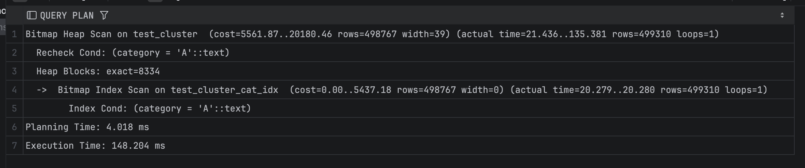
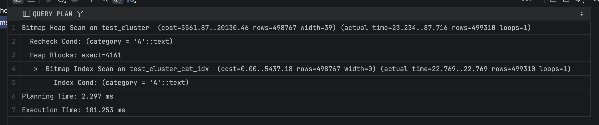

## Задание 3

1. Создайте таблицу с большим количеством данных:
    ```sql
    CREATE TABLE test_cluster AS 
    SELECT 
        generate_series(1,1000000) as id,
        CASE WHEN random() < 0.5 THEN 'A' ELSE 'B' END as category,
        md5(random()::text) as data;
    ```

2. Создайте индекс:
    ```sql
    CREATE INDEX test_cluster_cat_idx ON test_cluster(category);
    ```

3. Измерьте производительность до кластеризации:
    ```sql
    EXPLAIN ANALYZE
    SELECT * FROM test_cluster WHERE category = 'A';
    ```
    
    *План выполнения:*
 
    
    *Объясните результат:*  
    До кластеризации поиск по category = ‘A’ выполняется с использованием bitmap index scan и bitmap heap scan. Хотя используется индекс test_cluster_cat_idx, строки с категорией ‘A’ равномерно распределены по таблице из-за случайной генерации данных. Поэтому PostgreSQL вынужден обращаться ко множеству несвязанных heap-страниц. Это приводит к большому числу дисковых обращений, и выполнение занимает значительное время.

4. Выполните кластеризацию:
    ```sql
    CLUSTER test_cluster USING test_cluster_cat_idx;
    ```
    
    *Результат:*
    ```
   [2025-12-19 03:37:02] workshop.public> CLUSTER test_cluster USING test_cluster_cat_idx
    [2025-12-19 03:37:03] completed in 681 ms
   ```

5. Измерьте производительность после кластеризации:
    ```sql
    EXPLAIN ANALYZE
    SELECT * FROM test_cluster WHERE category = 'A';
    ```
    
    *План выполнения:*
 
    
    *Объясните результат:*  
    После кластеризации таблица была физически отсортирована в порядке индекса test_cluster_cat_idx. В результате строки с category=‘A’ оказались в соседних страницах heap. Bitmap Index Scan по прежнему используется, однако Bitmap Heap Scan читает значительно меньше разрозненных страниц (Heap Blocks уменьшилось с ~8300 до ~4100). За счёт устранения случайных обращений к диску общее время выполнения запроса сократилось с ~148 ms до ~101 ms. Таким образом, кластеризация ускорила выполнение запроса, поскольку данные были размещены в физическом порядке, совпадающем с порядком индекса.

6. Сравните производительность до и после кластеризации:
    
    *Сравнение:*  
    Кластеризация не изменила тип плана, но за счёт физического упорядочивания данных по столбцу category заметно уменьшила количество читаемых heap-страниц и сократила время выполнения запроса (примерно с 148 ms до 101 ms). Кластеризация даёт выигрыш именно для запросов, которые используют индекс, по которому таблица была отсортирована.